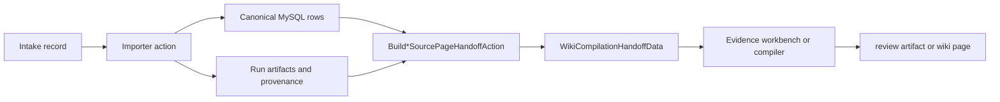
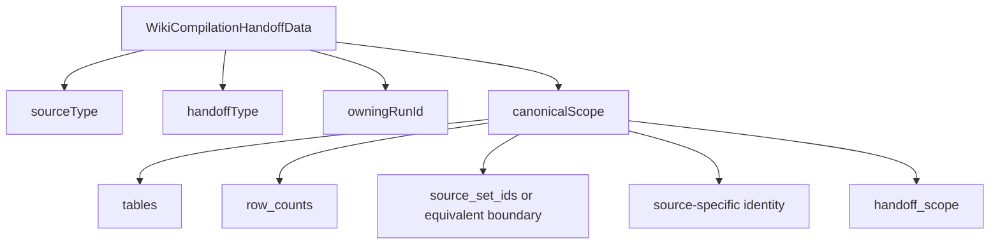
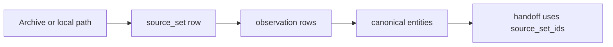
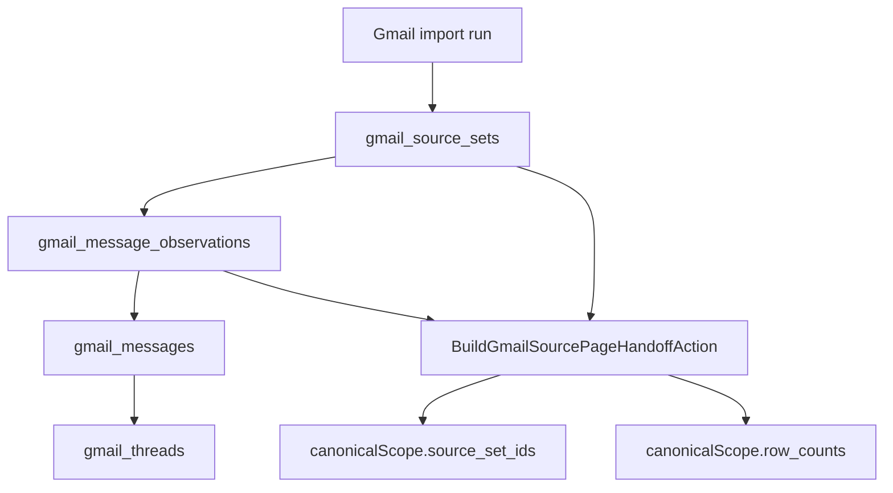
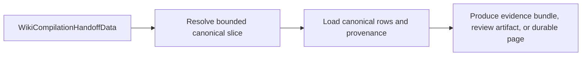

# Handoff Explainer

This is the missing "what the hell is the handoff?" note.

Short version:

- an importer writes canonical rows into MySQL
- the importer then builds a small payload that says "compile from this bounded slice"
- post-import tooling can consume that payload instead of rescanning raw archives

The handoff is not the data itself.
It is a pointer to the right data, plus enough scope information to keep compilation honest.

## Why it exists

Without a handoff, the compiler has two bad options:

1. rescan raw source files again
2. query canonical tables too broadly and accidentally compile the wrong slice

The handoff exists to kill both of those.

It says:

- which source this is
- which run owns the slice
- which canonical tables matter
- which bounded row set or source-set ids define the slice
- how many rows are in that slice

## The basic flow

The important bit is that `Build*SourcePageHandoffAction` reads canonical state and produces a compile-facing boundary.

## What a handoff is made of

Today the shared shape is `WikiCompilationHandoffData`:

- `sourceType`
- `handoffType`
- `owningRunId`
- `canonicalScope`

`canonicalScope` is where the useful stuff lives.
That part varies by source, but the pattern is the same.

Examples of source-specific identity:

- Gmail: `account_email`, `query`
- SMS: `source_locator`, `attachments_root`
- Instagram: `username`
- Media collection: `volumes`, `volume_filter`

## The boundary idea

This is the whole game.

The handoff is only useful if it points to a real bounded slice.
That boundary can be expressed in different ways depending on the source.

### Archive-style sources

For sources like SMS or ChatGPT, the boundary is usually a `source_set`.

That means the compiler can say:

- compile only the messages observed in these `source_set_ids`
- not every message ever seen for that source

### Gmail after the boundary fix

Gmail used to be fuzzy here.
It found the account for the run, then counted the whole account.
That was wrong.

Now Gmail has a real boundary too:

So if two runs hit the same Gmail account with different queries:

- `label:alpha`
- `label:beta`

they get different Gmail source sets, and the handoff for `label:beta` only points at the `beta` slice.

## Why not compile straight from the run id?

Because a run id is not enough by itself.

The compiler needs to know:

- what the stable logical slice is
- how to re-find that slice in canonical rows
- how broad the selection is allowed to be

The run id tells you who owns the handoff.
The boundary inside `canonicalScope` tells you what to compile.

## What this buys the post-import layer

The next layer after import can stay dumb in the good way.

It does not need to understand raw source formats.
It only needs to:

1. accept a handoff
2. query the canonical slice described by that handoff
3. render a review artifact or durable page if needed
4. reject extraction or generation if provenance or scope is missing

That is the separation:

- importers normalize source mess into canonical rows
- handoffs define the bounded compile slice
- compilation turns that bounded slice into markdown

The downstream tool should not care whether the source was Gmail, SMS, Instagram, or something else ugly.
It should care that the handoff gives it a stable bounded slice and enough provenance to refuse nonsense.

## Mental model

If it helps, think of the handoff as a shipping label.

- the canonical tables are the warehouse
- the handoff is the label saying which boxes belong on this truck
- the compiler is the truck

Without the label, the truck either grabs everything or starts rummaging through the loading dock like a confused raccoon.

## Current rule of thumb

When a source has a handoff, the compiler should be able to answer:

- what source am I compiling?
- which exact canonical slice am I allowed to touch?
- how do I prove this slice came from a real successful run?

If the handoff cannot answer that, it is not done yet.
